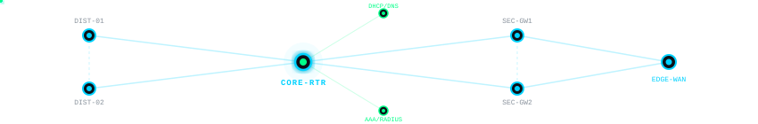

<div align="center">

<!-- Animated Header Wave Banner -->


<!-- Dynamic Animated Typing Terminal -->
<a href="https://github.com/abdulwahabsaim">
  
</a>
<br/>
<!-- Live Animated Dual-Theme Topology -->

<br/>
<br/>
<br/>

<!-- Real-Time Telemetry Badges -->
<p align="center">
  <a href="https://cisco.com"></a>
  
  
  
  
</p>


</div>


## 📌 About Me & Value Proposition

* 🎓 **Academic Profile:** 7th-Semester **Bachelor of Science in Computer Science** student specializing in networking architectures, routing protocols, and systems administration.
* 📜 **Industry Certification:** **Cisco Certified Network Associate (CCNA 200-301)**.
* 🇳🇱 **Netherlands Work Authorization:** Legally authorized to work in the Netherlands (**W-document** / direct right to employment without immediate sponsorship requirements).
* 🎯 **Career Goal:** Seeking **Junior Network Engineer**, **NOC Engineer (Level 1/2)**, or **Network Operations Specialist** roles at enterprise NOCs, MSPs, ISPs, or datacenters across the Netherlands (Amsterdam / Randstad / Utrecht / Hybrid).
* 🛠️ **Engineering Mindset:** Bridging **Computer Science scripting** (Python, Scapy, Linux) with **hardcore network infrastructure** (OSPF, EIGRP, HSRP, 802.1Q, Port Security).


## 🗂️ Featured Network Engineering Repositories

<div align="center">

| Node / Repository | Focus Domains | Core Protocols & Architecture | Verification Highlights | Live Link |
| :--- | :--- | :--- | :--- | :---: |
|  | **Enterprise Routing & High Availability** | **EIGRP AS 7 • Multi-Area OSPF • HSRP v2 • 5-Node WAN Mesh (ECMP) • Multi-Hop Static** | • ABR Type-3 Inter-Area LSAs<br/>• Dual-segment active/standby failover<br/>• Symmetrical multi-path transit RIB | [**`enterprise-routing-labs` →**](https://github.com/abdulwahabsaim/enterprise-routing-labs) |
|  | **Switching Infrastructure & Campus Hardening** | **STP Root Guard • Loop Guard • Port Security • Extended ACLs • 802.1Q VTP** | • Rogue Root Bridge hijack defense (`ROOT_Inc`)<br/>• Dynamic, Static & Sticky MAC limits<br/>• Unidirectional link loop mitigation | [**`layer2-security-labs` →**](https://github.com/abdulwahabsaim/layer2-security-labs) |
|  | **Core Application-Layer Services** | **DHCP (D.O.R.A) • Authoritative DNS A-Records • HTTP/HTTPS Web Hosting** | • End-to-end client lifecycle workflow<br/>• Automated dynamic lease provisioning<br/>• FQDN-to-IP resolution & browser delivery | [**`network-services-labs` →**](https://github.com/abdulwahabsaim/network-services-labs) |

</div>


## 🚀 Complete Hands-On Lab Inventory

```text
├── 📁 enterprise-routing-labs/
│   ├── 01-dynamic-routing-eigrp/           --> EIGRP AS 7, DUAL algorithm, composite metric calculation
│   ├── 02-dynamic-routing-multi-area-ospf/ --> Hierarchical Multi-Area OSPFv2 (Area 0 & 1, ABR Type-3 LSAs)
│   ├── 03-multi-router-wan-mesh-ecmp/      --> 5-Router Full-Mesh WAN (K5), Equal-Cost Multi-Path (ECMP)
│   ├── 04-multi-hop-static-routing/        --> 3-Router Multi-Hop linear WAN, transit routing, symmetrical returns
│   └── 05-hsrp-gateway-redundancy/         --> Dual-Segment HSRPv2 (Groups 1 & 2), active/standby preemption
│
├── 📁 layer2-security-labs/
│   ├── 01-access-control-lists-acl/        --> Extended ACL 105, TCP 23 Telnet filtering, implicit deny handling
│   ├── 02-vlan-trunking-and-vtp/           --> 802.1Q trunking, VLAN segmentation, VTP Server/Client sync
│   ├── 03-port-security-mac-limiting/      --> Shutdown / Protect / Restrict modes, Dynamic/Static/Sticky MACs
│   ├── 04-stp-root-guard/                  --> STP Root Bridge hijack defense (ROOT_Inc blocking state)
│   └── 05-stp-bpdu-filtering-and-loop-guard/ -> STP Loop Guard, unidirectional link loss & BPDU filter defense
│
└── 📁 network-services-labs/
    └── 01-core-network-services-dhcp-dns-http/ -> Integrated DHCP D.O.R.A, DNS A-Record, Web Server lifecycle
```


## 🧰 Technical Skills & Protocol Matrix

<div align="center">

### 🌐 Routing, Switching & Campus Security
<p align="center">
  
  
  
  
  
  
  
  
  
</p>

### 🐧 Systems, Observability & Network Tools
<p align="center">
  
</p>
<p align="center">
  
  
  
</p>

### 💻 Computer Science & Software Development
<p align="center">
  
</p>

</div>


## 📊 Telemetry & Contribution Activity

<div align="center">


</div>


## 📬 Terminal Contact Endpoints
<div align="center">

[](https://www.linkedin.com/in/abdulwahabsaim/)
[](mailto:abdulwahabsaim58.nl@gmail.com)
[](https://github.com/abdulwahabsaim)

<br/>


</div>
