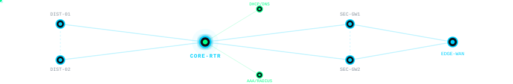

<div align="center">

<!-- Animated Header Wave Banner -->


<!-- Dynamic Animated Typing Terminal -->
<a href="https://github.com/abdulwahabsaim">
  
</a>
<br/>
<!-- Live Animated Dual-Theme Topology -->

<br/>
<br/>
<br/>

<!-- Real-Time Telemetry Badges -->
<p align="center">
  <a href="https://cisco.com"></a>
  
  
  
  
</p>

</div>


## 📌 About Me & Value Proposition

* 🎓 **Academic Profile:** 7th-Semester **Bachelor of Science in Computer Science** student specializing in enterprise networking, routing protocols, and systems administration.
* 📜 **Industry Certification:** **Cisco Certified Network Associate (CCNA 200-301)**.
* 🏆 **Flagship Capstone Project:** Architected, configured, and verified a 15-device multi-tier hierarchical campus network ([`cisco-enterprise-campus-mega-lab`](https://github.com/abdulwahabsaim/cisco-enterprise-campus-mega-lab), based on Jeremy's IT Lab CCNA Mega Lab), featuring a wire-speed Layer 3 Core, Active-Active HSRPv2, deterministic Rapid-PVST+ root alignment, OSPFv2 Area 0, Layer 2 Security (DAI/DHCP Snooping/Port-Security), Cisco 3504 WLC mobility, and IPv6 dual-stack.
* 🇳🇱 **Netherlands Work Authorization:** Legally authorized to work in the Netherlands (**W-document** / direct right to employment without immediate sponsorship requirements).
* 🎯 **Career Goal:** Seeking **Junior Network Engineer**, **NOC Engineer (Level 1/2)**, or **Network Operations Specialist** roles at enterprise NOCs, MSPs, ISPs, or datacenters across the Netherlands (Amsterdam / Randstad / Utrecht / Hybrid).
* 🛠️ **Engineering Mindset:** Bridging **Computer Science scripting** (Python, Scapy, Linux) with **production network infrastructure** (OSPF, EIGRP, HSRP, 802.1Q, Port Security, Wireless, NAT/PAT).


## 🗂️ Featured Network Engineering Repositories

<div align="center">

| Node / Repository | Focus Domains | Core Protocols & Architecture | Verification Highlights | Live Link |
| :--- | :--- | :--- | :--- | :---: |
|  | **Enterprise Campus Capstone (15 Nodes)** | **Hierarchical 3-Tier Campus • Wire-Speed L3 Core • Active-Active HSRPv2 • OSPFv2 Area 0 • Dual-ISP Floating WAN • DAI & DHCP Snooping • Cisco 3504 WLC • IPv6 Dual-Stack** | • 100% Packet Tracer Assessment Score<br/>• 0% inter-switch trunk hairpinning<br/>• 10-Slide High-Res Architecture Deck | [**`cisco-enterprise-campus-mega-lab` →**](https://github.com/abdulwahabsaim/cisco-enterprise-campus-mega-lab) |
|  | **Enterprise Routing & High Availability (13 Labs)** | **EIGRP AS 7 • Multi-Area OSPF • HSRP v2 • 5-Node WAN Mesh (ECMP) • Multi-Hop Static • Floating Static • QoS • GRE** | • ABR Type-3 Inter-Area LSAs<br/>• Dual-segment active/standby failover<br/>• Symmetrical multi-path transit RIB | [**`enterprise-routing-labs` →**](https://github.com/abdulwahabsaim/enterprise-routing-labs) |
|  | **Switching Infrastructure & Campus Hardening (13 Labs)** | **STP Root Guard • Loop Guard • Port Security • Extended ACLs • 802.1Q VTP • EtherChannel • DAI • Voice VLAN** | • Rogue Root Bridge hijack defense (`ROOT_Inc`)<br/>• Dynamic, Static & Sticky MAC limits<br/>• Unidirectional link loop mitigation | [**`layer2-security-labs` →**](https://github.com/abdulwahabsaim/layer2-security-labs) |
|  | **Core Application-Layer Services & Mobility (5 Labs)** | **DHCP (D.O.R.A) • DHCP Relay • Authoritative DNS • Stratum 5 NTP • Syslog Telemetry • Cisco WLC** | • End-to-end client lifecycle workflow<br/>• Option 43 / Option 150 provisioning<br/>• SIEM-ready microsecond timestamps | [**`network-services-labs` →**](https://github.com/abdulwahabsaim/network-services-labs) |

</div>


## 🚀 Complete Hands-On Lab Inventory (32 Production Labs)

```text
├── 🏆 cisco-enterprise-campus-mega-lab/     [FLAGSHIP CAPSTONE // 15 DEVICES]
│   ├── configs/                            --> 15 clean Cisco IOS running configs (.ios / .md)
│   ├── slides/                             --> 10-slide high-res architecture gallery & runbook
│   ├── docs/                               --> 17-subnet IP addressing & VLAN allocation matrix
│   └── CCNA Mega Lab (Jeremy_s IT Lab).pka --> 100% verified simulation assessment package
│
├── 📁 enterprise-routing-labs/             [13 PRODUCTION LABS]
│   ├── 01-dynamic-routing-eigrp/           --> EIGRP AS 7, DUAL algorithm, composite metric calculation
│   ├── 02-dynamic-routing-multi-area-ospf/ --> Hierarchical Multi-Area OSPFv2 (Area 0 & 1, ABR Type-3 LSAs)
│   ├── 03-multi-router-wan-mesh-ecmp/      --> 5-Router Full-Mesh WAN (K5), Equal-Cost Multi-Path (ECMP)
│   ├── 04-multi-hop-static-routing/        --> 3-Router Multi-Hop linear WAN, transit routing, symmetrical returns
│   ├── 05-hsrp-gateway-redundancy/         --> Dual-Segment HSRPv2 (Groups 1 & 2), active/standby preemption
│   ├── 06-intervlan-routing-multilayer-svi/ --> SVI Layer 3 routing, trunk encapsulation, inter-VLAN forwarding
│   ├── 07-floating-static-routes-wan-failover/ --> Dual-WAN resiliency, floating static route, AD 5 backup
│   ├── 08-ospf-neighbor-troubleshooting-lsdb/ --> LSDB synchronization, OSPF neighbor states, MTU mismatch triage
│   ├── 09-ipv6-dual-stack-routing-slaac/   --> IPv6 global unicast, EUI-64, SLAAC, static default routing
│   ├── 10-enterprise-edge-nat-pat-overload/ --> Inside source NAT, dynamic PAT overload pool, translation timeouts
│   ├── 11-modular-qos-traffic-prioritization/ --> MQC class-maps, policy-maps, priority queuing, DSCP marking
│   ├── 12-site-to-site-gre-tunnel-ospf/    --> Point-to-Point GRE encapsulation, tunnel keepalives, OSPF over GRE
│   └── 13-dynamic-routing-eigrp-variance/  --> Unequal-cost load balancing, variance multiplier, feasible successor
│
├── 📁 layer2-security-labs/                [13 PRODUCTION LABS]
│   ├── 01-access-control-lists-acl/        --> Extended ACL 105, TCP 23 Telnet filtering, implicit deny handling
│   ├── 02-vlan-trunking-and-vtp/           --> 802.1Q trunking, VLAN segmentation, VTP Server/Client sync
│   ├── 03-port-security-mac-limiting/      --> Shutdown / Protect / Restrict modes, Dynamic/Static/Sticky MACs
│   ├── 04-stp-root-guard/                  --> STP Root Bridge hijack defense (ROOT_Inc blocking state)
│   ├── 05-stp-bpdu-filtering-and-loop-guard/ --> STP Loop Guard, unidirectional link loss & BPDU filter defense
│   ├── 06-etherchannel-lacp-pagp-layer3/   --> Multi-link aggregation, PAgP desirable vs LACP active, routed Po1
│   ├── 07-cdp-lldp-discovery-and-hardening/ --> Device discovery telemetry, IEEE 802.1AB LLDP TLVs, perimeter disabling
│   ├── 08-secure-device-management-sshv2/  --> RSA 2048-bit keys, SSHv2 enforcement, VTY transport restrictions
│   ├── 09-switchport-voice-vlan-telephony/ --> 802.1p CoS tagging, Voice VLAN 20, auxiliary trunk encapsulation
│   ├── 10-dhcp-snooping-and-dynamic-arp-dai/ --> Rogue DHCP mitigation, untrusted rate-limiting, DAI ARP inspection
│   ├── 11-stp-hsrp-active-root-alignment/  --> Eliminating inter-switch trunk saturation via deterministic root alignment
│   ├── 12-vtp-modes-and-dtp-hardening/     --> VTP Transparent mode, DTP switchport nonegotiate, native VLAN 999
│   └── 13-enterprise-extended-acls-service-filtering/ --> Strict multi-tier service filtering, established TCP flags
│
└── 📁 network-services-labs/               [5 PRODUCTION LABS]
    ├── 01-core-network-services-dhcp-dns-http/ --> Integrated DHCP D.O.R.A, DNS A-Record, Web Server lifecycle
    ├── 02-centralized-dhcp-relay-ip-helper/ --> Multi-subnet DHCP relay, GIADDR rewriting, IP helper-address
    ├── 03-ntp-stratum-hierarchy-authentication/ --> Stratum 1-3 synchronization, MD5 authentication keys, drift control
    ├── 04-centralized-syslog-telemetry/    --> Remote UDP 514 syslog server, millisecond timestamps, logging levels
    └── 05-enterprise-wlc-centralized-wireless/ --> Cisco 3504 WLC setup, Option 43 discovery, Split-MAC CAPWAP join
```


## 🧰 Technical Skills & Protocol Matrix

<div align="center">

### 🌐 Routing, Switching & Campus Security
<p align="center">
  
  
  
  
  
  
  
  
  
  
  
  
  
  
</p>

### 🐧 Systems, Observability & Network Tools
<p align="center">
  
</p>
<p align="center">
  
  
  
  
</p>

### 💻 Computer Science & Software Development
<p align="center">
  
</p>

</div>


## 📊 Telemetry & Contribution Activity

<div align="center">


</div>


## 📬 Terminal Contact Endpoints
<div align="center">

[](https://www.linkedin.com/in/abdulwahabsaim/)
[](mailto:abdulwahabsaim58.nl@gmail.com)
[](https://github.com/abdulwahabsaim)

<br/>


</div>
